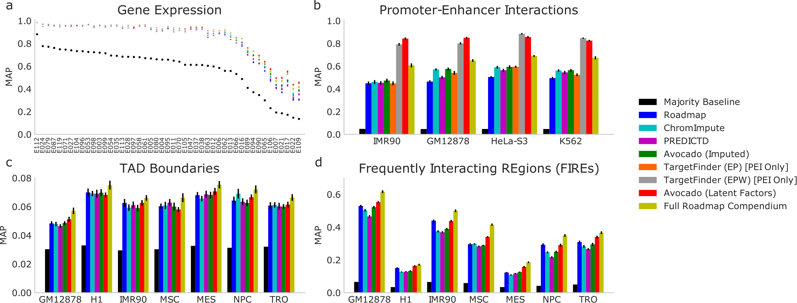

# avocado

<p align="center">
	
</p>

Avocado is a multi-scale deep tensor factorization model that is used to learn a latent representation of the human epigenome. The purpose of this model is two fold; first, to impute epigenomic experiments that have not yet been performed, and second, to use the learned latent representation as input to machine learning models in the place of epigenomic data for downstream genomics tasks. The project page with links to the full set of imputations and model parameters can be found at https://noble.gs.washington.edu/proj/avocado/. The manuscript is currently under review at *Nature Methods* and the preprint can be found [here](https://www.biorxiv.org/content/early/2018/07/08/364976).

### Installation

Avocado can be installed using pip.

```
pip install avocado-epigenome
```

### What can Avocado do?

Firstly, Avocado can impute the signal values for epigenomic experiments that have not yet been performed and achieves higher accuracy than either ChromImpute or PREDICTD, two previous methods. These imputations are of arcsinh transformed -log10 p-values at 25 bp resolution and cover the entirety of chromosomes 1 through 22. The animation below shows an example of how Avocado's imputations on one particular track of data improve as the model trains over 400 epochs.

<p align="center">
	
</p>

Secondly, Avocado's learned latent representations are an informative portrayal of the human epigenome. Rather than represent each base-pair using the measurements from over a thousand epigenomic experiments that have been performed, each base-pair is represented by a Avocado's low dimensional representation that reduces redundancy and noise amongst the many performed assays. The genomic latent representation is particularly powerful when fed as input to machine learning models, frequently outperforming models trained on epigenomic data itself.

<p align="center">
	
</p>

### How can I use Avocado?

Using Avocado is easy! We can create the model just by passing in a list of cell types, a list of assays, and specifying the various hyperparameters. Here is an example of creating a very small model thhat could potentially be trained on a CPU.

```python
from avocado import Avocado

model = Avocado(celltypes, assays, n_layers=1, n_nodes=64, n_assay_factors=24, 
				n_celltype_factors=32, n_25bp_factors=5, n_250bp_factors=20, 
				n_5kbp_factors=30, batch_size=10000)
```

The format of the training data is that of a dictionary where the keys are (cell type, assay) pairs and the value is the corresponding track of epigenomic data.


```python
celltypes = ['E003', 'E017', 'E065', 'E116', 'E117']
assays = ['H3K4me3', 'H3K27me3', 'H3K36me3', 'H3K9me3', 'H3K4me1']

data = {}
for celltype, assay in itertools.product(celltypes, assays):
    filename = 'data/{}.{}.pilot.arcsinh.npz'.format(celltype, assay)
    data[(celltype, assay)] = numpy.load(filename)['arr_0']
```

Now you can fit your model to that data for some number of epochs, where an epoch is defined as some number of batches. Typically one wants to balance the epoch size and the batch size such that one epoch is equal to one pass over the genomic axis. The default training generator scans sequentially through the genome, randomly selecting experiments in the training set to train on at each position.

```python
model.fit(data, n_epochs=10, epoch_size=100)
```

After you're done fitting your model you can then impute any track from the cell types and assays that you trained on. In this case we trained on all tracks, but this can be as dense or sparse as one would like as long as there is at least one example of each cell type and assay.

```python
track = model.predict("E065", "H3K4me3")
```

There are currently two tutorials in the form of Jupyter notebooks. One focuses on how to use this code to train an Avocado model, make imputations, and extract the resulting latent factors. The second shows how one might use the latent factors to make predictions in two downstream tasks. 

### Can I add my own cell type and assay to your model?

Yes! The model is flexible enough to allow one to easily add in new cell types or assays without needing to retrain all of the parameters. The procedure is essentially to freeze the latent factors on the genome axis, the neural network parameters, and the latent factors in the assay embedding if you're adding in a new cell type or in the cell type embedding if you're adding in a new assay. Then, one can learn the latent factors corresponding either to the cell types or assays to be added in. This works because the frozen neural network parameters ensure that the new embedding is comparable to the old one. In fact, this is how we learn genomic representations that are comparable from one chromosome to another despite training the representations independently.

Programmatically, the procedure is to either train your initial model as normal or to get a pre-trained model (such as the Avocado model we provide). Let's train our initial model using only four of the five example cell types.

```python
import numpy, itertools
from avocado import Avocado

celltypes = ['E003', 'E017', 'E065', 'E116', 'E117']
assays = ['H3K4me3', 'H3K27me3', 'H3K36me3', 'H3K9me3', 'H3K4me1']

data = {}
for celltype, assay in itertools.product(celltypes[1:], assays):
	filename = 'data/{}.{}.pilot.arcsinh.npz'.format(celltype, assay)
	data[(celltype, assay)] = numpy.load(filename)['arr_0']

model = Avocado(celltypes[1:], assays, n_25bp_factors=5, n_250bp_factors=5, 
	n_5kbp_factors=5, n_layers=1, n_nodes=16, n_celltype_factors=16, 
	n_assay_factors=24)

model.summary()
model.fit(data, n_epochs=25)
```

We then need to save the model to disk.

```python
model.save("avocado")
```

Then we need to load up the weights of our trained model to a new Avocado model that freezes all parameters except the cell type embedding and train it.

```python
data2 = {}
for celltype, assay in itertools.product(celltypes[:1], assays):
	filename = 'data/{}.{}.pilot.arcsinh.npz'.format(celltype, assay)
	data2[(celltype, assay)] = numpy.load(filename)['arr_0']

model2 = Avocado(celltypes[:1], assays, n_25bp_factors=5, n_250bp_factors=5, 
	n_5kbp_factors=5, n_layers=1, n_nodes=16, n_celltype_factors=16, 
	n_assay_factors=24, freeze_network=True, freeze_genome_25bp=True,
	freeze_genome_250bp=True, freeze_genome_5kbp=True, freeze_assays=True)

model2.summary()
model2.load_weights("avocado", verbose=2)
model2.fit(data2, n_epochs=25)
```

Now we can use this model to impute any epigenomic experiments covered by this model for this new cell type!
