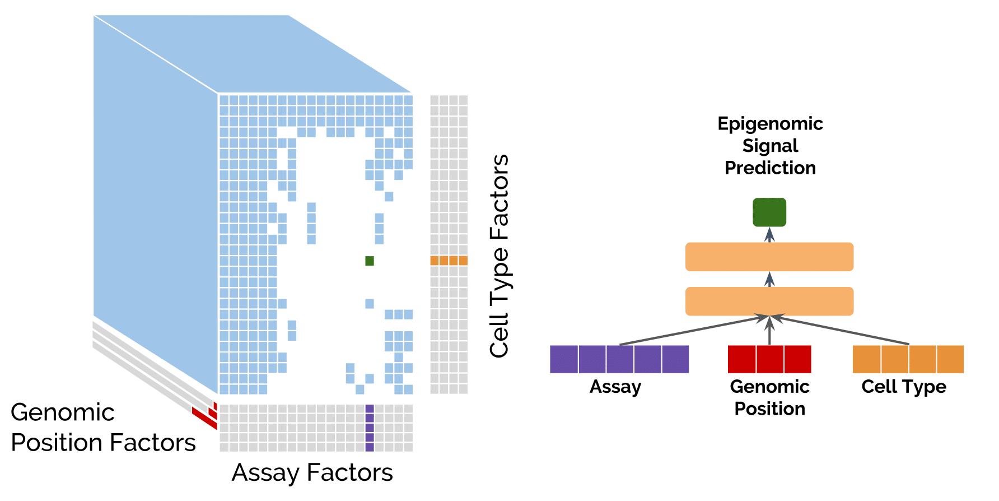
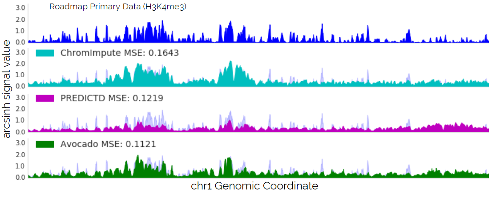
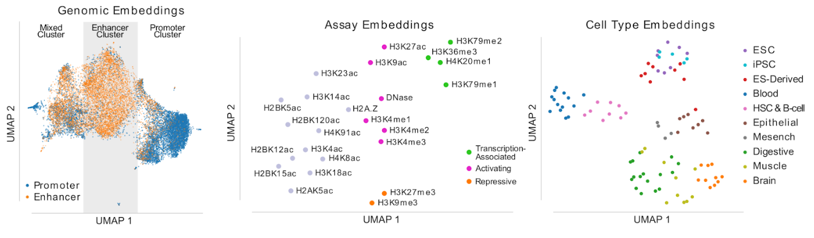

## avocado

<p align="center">
	
</p>

Avocado is a multi-scale deep tensor factorization model that is used to learn a latent representation of the human epigenome. The purpose of this model is two fold; first, to impute epigenomic experiments that have not yet been performed, and second, to learn a latest representation of the human epigenome that can be used as input for machine learning models in the place of epigenomic data itself. 

[**ISMB 2018 Slides**](https://noble.gs.washington.edu/proj/avocado/Avocado_ISCB_2018_NoAnimation.pdf) <br>

1. [**Multi-scale deep tensor factorization learns a latent representation of the human epigenome**](https://www.biorxiv.org/content/early/2018/07/08/364976) <br>

This model was trained on 1,014 tracks of epigenomic data from the Roadmap Epigenomics Mapping Consortium (REMC) that include chromatin accessibility (DNase-seq) and 23 tracks of histone modification (ChIP-seq) from 127 human primary cell lines and tissues.

[**Model (including the learned latent space)**](https://noble.gs.washington.edu/proj/avocado/model/) <br>
[**Imputations of the Roadmap Compendium**](https://noble.gs.washington.edu/proj/avocado/data/avocado_full/) (*Note: these imputations were generated from a model trained on 1,014 tracks from the full Roadmap compendium. If you would like the imputations as a result of five-fold cross-validation to baseline your approach against, please reach out to me*) <br>

2. [**Completing the ENCODE3 compendium yields accurate imputations across a variety of assays and human biosamples**](https://www.biorxiv.org/content/10.1101/533273v1)

This model was trained on 3,814 tracks of epigenomic data from the ENCODE Compendium that include chromatin accessibility (DNase-seq and ATAC-seq), measurements of gene transcription (including CAGE, RAMPAGE, polyA-depleted, etc.), histone modifications, and DNA-binding proteins such as transcription factors. 

**Model (including the learned latent space)** Currently being completed. <br>
**Imputations of the ENCODE3 Compendium** Currently being completed <br>

#### Installation

Avocado can be installed using pip.

```
pip install avocado-epigenome
```

### Imputing epigenomic data

Avocado can impute signal values for epigenomic experiments that have not yet been performed with high accuracy. These imputations are of arcsinh transformed -log10 p-values at 25 bp resolution and cover the entirety of chromosomes 1 through 22. Making imputations with a pre-trained model requires only two lines; loading the model, and calling the predict method. We can start by loading up the [pre-trained model](https://noble.gs.washington.edu/proj/avocado/model/) for chromosome 19.

```python
>>> from avocado import Avocado
>>> model = Avocado.load("avocado-chr19")
```

This will create a model with the architecture specified in `avocado-chr19.json` and load the weights from the file `avocado-chr19.h5`. 

Now, we can use this model to impute values for any combination of cell type and assay that are contained in the model. The attributes `model.celltypes` and `model.assays` should list those that are contained in the model. 

```python
>>> track = model.predict("E004", "H3K36me3")
>>> track
array([ 0.11702164,  0.12218985,  0.12052222, ..., -0.06277317,
       -0.06284004, -0.06013602], dtype=float32)
```

This will yield imputations at 25 bp resolution across chromosome 19 for the assay H3K36me3 in cell type E004. These imputations will be the same as the ones provided in the [imputations folder](https://noble.gs.washington.edu/proj/avocado/data/avocado_full/). 

```python
>>> import numpy
>>> data = numpy.load("H3K36me3/E004.H3K36me3.chr19.avocado.npz")['arr_0']
>>> data
array([ 0.11702165,  0.12218987,  0.12052223, ..., -0.06277314,
       -0.06284001, -0.06013602], dtype=float32)
```

Note that because the genome is so long the genome factors cannot fit entirely in memory. Accordingly, we have split the model into one per chromosome, where the neural network parameters, cell type embedding, and assay embedding, are shared from one chromosome to the next.

The imputations are generally high quality and typically more accurate than competing methods. Below is an example of the imputation of H3K4me3 from ChromImpute, PREDICTD, and Avocado.

<p align="center">
	
</p>

### Using the learned latent representation

<p align="center">
	
</p>

The learned cell type representation is shown above. Each of the points corresponds to a cell type included in the model, and are colored by their function. As you can see, they cluster very well according to this function. All three embeddings can be extracted from the commands using the following simple commands:

```python
>>> genome_embedding = model.genome_embedding
>>> celltype_embedding = model.celltype_embedding
>>> assay_embedding = model.assay_embedding
```

The cell type and assay embeddings will return simply the learned embeddings from the model. The genome embedding will consist of the 25 bp, the 250 bp, and the 5 kbp factors concatenated together at 25 bp resolution such that 10 positions in a row share the same values for the 250 bp factors and 200 positions in a row share the same 5 kbp factor values.

#### Training a new model

Using Avocado is easy! We can initialize the model just by passing in a list of cell types, a list of assays, and specifying the various hyperparameters. The defaults for all of the hyperparameters are those that were used in the manuscript. Here is an example of creating a very small model that could potentially be trained on a CPU.

```python
>>> from avocado import Avocado
>>> 
>>> model = Avocado(celltypes, assays, n_layers=1, n_nodes=64, n_assay_factors=24, 
				n_celltype_factors=32, n_25bp_factors=5, n_250bp_factors=20, 
				n_5kbp_factors=30, batch_size=10000)
```

The format of the training data is that of a dictionary where the keys are (cell type, assay) pairs and the value is the corresponding track of epigenomic data.


```python
>>> celltypes = ['E003', 'E017', 'E065', 'E116', 'E117']
>>> assays = ['H3K4me3', 'H3K27me3', 'H3K36me3', 'H3K9me3', 'H3K4me1']
>>> 
>>> data = {}
>>> for celltype, assay in itertools.product(celltypes, assays):
>>>	if celltype == "E065" and assay == "H3K4me3":
>>>		continue
>>>	filename = 'data/{}.{}.pilot.arcsinh.npz'.format(celltype, assay)
>>> 	data[(celltype, assay)] = numpy.load(filename)['arr_0']
```

Now you can fit your model to that data for some number of epochs, where an epoch is defined as some number of batches. Typically one wants to balance the epoch size and the batch size such that one epoch is equal to one pass over the genomic axis. The default training generator scans sequentially through the genome, randomly selecting experiments in the training set to train on at each position.

```python
>>> model.fit(data, n_epochs=10, epoch_size=100)
```

After you're done fitting your model you can then impute any track from the cell types and assays that you trained on. In this case we trained on all tracks, but this can be as dense or sparse as one would like as long as there is at least one example of each cell type and assay.

```python
>>> track = model.predict("E065", "H3K4me3")
```

There are currently two tutorials in the form of Jupyter notebooks. One focuses on how to use this code to train an Avocado model, make imputations, and extract the resulting latent factors. The second shows how one might use the latent factors to make predictions in two downstream tasks. 

<p align="center">
	
</p>

#### Can I add my own cell type and assay to your model?

Yes! The model is flexible enough to allow one to easily add in new cell types or assays without needing to retrain all of the parameters. The procedure is essentially to freeze the latent factors on the genome axis, the neural network parameters, and the latent factors in the assay embedding if you're adding in a new cell type or in the cell type embedding if you're adding in a new assay. Then, one can learn the latent factors corresponding either to the cell types or assays to be added in. This works because the frozen neural network parameters ensure that the new embedding is comparable to the old one. In fact, this is how we learn genomic representations that are comparable from one chromosome to another despite training the representations independently.

Programmatically there is a built-in function that allows you to pass in data for new cell types or assays and learn their respective embeddings. All you have to do to add in new cell types is make a data dictionary with the same format as training the model like the normal `fit` method except that the cell types are all new and the assays are those that are already in the model.

```python
>>> data = {}
>>> for assay in assays:
>>>	filename = 'data/E004.{}.pilot.arcsinh.npz'.format(celltype, assay)
>>>	data[('E004', assay)] = numpy.load(filename)['arr_0']
>>>
>>> model.fit_celltypes(data, n_epochs=5)
```

The model will freeze all the parameters and only learn the embeddings for the new cell types (or assays if you use `fit_assays` instead). Once those new embeddings are used you can impute any epigenomic experiments for the new cell types just as if they were part of the original model!
